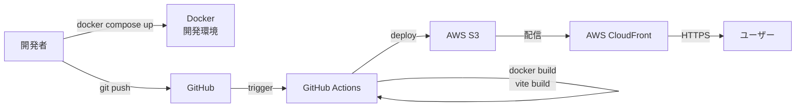
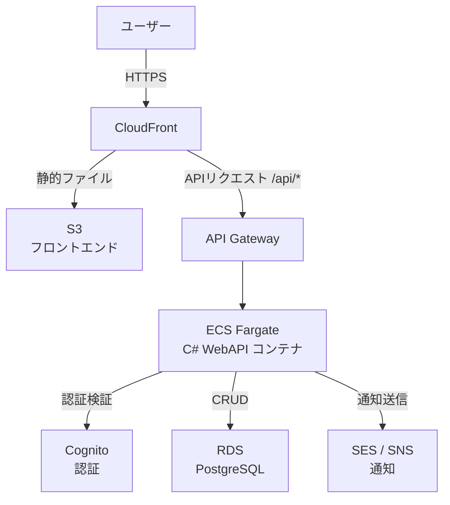
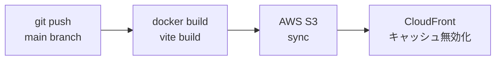
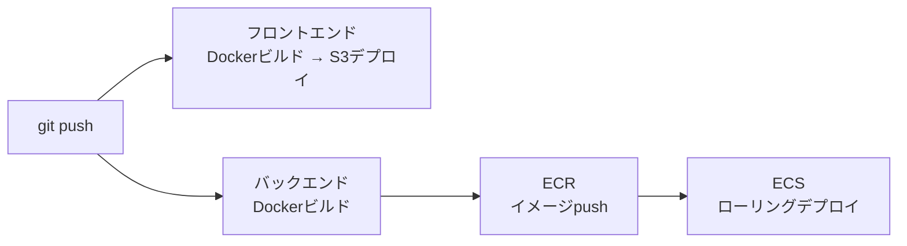

# 技術仕様書

**バージョン:** 1.0
**作成日:** 2026-03-22
**ステータス:** ドラフト

---

## 1. テクノロジースタック

### フロントエンド

| 項目 | 技術 | バージョン | 用途 |
|------|------|-----------|------|
| 言語 | TypeScript | 最新安定版 | メイン開発言語 |
| ビルドツール | Vite | 最新安定版 | 開発サーバー・バンドル |
| スタイリング | Tailwind CSS | v4系 | UIスタイリング |
| パッケージマネージャー | npm | 最新安定版 | 依存関係管理 |
| コンテナ | Docker | 最新安定版 | 開発環境・本番ビルド |

### バックエンド（将来追加）

| 項目 | 技術 | バージョン | 用途 |
|------|------|-----------|------|
| 言語 | C# | .NET 9 | メイン開発言語 |
| フレームワーク | ASP.NET Core Web API | 9.0 | REST API |
| ORM | Entity Framework Core | 最新安定版 | DBアクセス |
| 認証 | ASP.NET Core Identity + JWT | - | ユーザー認証 |
| コンテナ | Docker | 最新安定版 | 実行環境 |

### データベース（将来追加）

| 項目 | 技術 | 用途 |
|------|------|------|
| RDBMS | PostgreSQL | タスクデータの永続化 |
| コンテナ | Docker | ローカル開発環境 |

### インフラ（AWS）

| フェーズ | サービス | 用途 |
|---------|---------|------|
| v1.0 | S3 | フロントエンド静的ファイルのホスティング |
| v1.0 | CloudFront | CDN・HTTPS化・キャッシュ |
| v1.0 | GitHub Actions | CI/CD（自動ビルド & デプロイ） |
| 将来 | ECS Fargate | C# WebAPI コンテナ実行環境 |
| 将来 | ECR | Dockerイメージレジストリ |
| 将来 | RDS (PostgreSQL) | データベース |
| 将来 | API Gateway | バックエンドAPIのエントリーポイント |
| 将来 | Cognito | ユーザー認証・認可 |
| 将来 | SES / SNS | メール・プッシュ通知 |

---

## 2. システム構成図

### v1.0（フロントエンドのみ）



### 将来構成（C# WebAPI + DB追加時）



---

## 3. Docker構成

### ファイル構成

環境ごとの差分を上書きする **オーバーライド方式** を採用しています。

| ファイル | 役割 |
|---------|------|
| `docker-compose.yml` | ベース設定（開発・本番共通）。パスワードは `.env` から読み込む |
| `docker-compose.dev.yml` | 開発用オーバーライド（ホットリロード・ポート公開） |
| `docker-compose.prod.yml` | 本番用オーバーライド（nginx・自動再起動） |

### 起動コマンド

```bash
# 開発環境
docker compose -f docker-compose.yml -f docker-compose.dev.yml up

# 本番環境
docker compose -f docker-compose.yml -f docker-compose.prod.yml up -d
```

### サービス構成

```
docker-compose.yml（ベース）
├── frontend          # TypeScript + Vite + Tailwind CSS
├── backend           # C# ASP.NET Core WebAPI
└── db                # PostgreSQL 16
```

### 開発環境と本番環境の違い

| 項目 | 開発（dev） | 本番（prod） |
|------|-----------|------------|
| フロントエンド | Vite 開発サーバー（ポート5173） | nginx（ポート80） |
| ホットリロード | あり（ボリュームマウント） | なし |
| DBポート公開 | あり（5432） | なし（コンテナ間通信のみ） |
| 自動再起動 | なし | あり（unless-stopped） |
| ASPNETCORE_ENVIRONMENT | Development | Production |

### Dockerfile 設計方針

**フロントエンド（マルチステージビルド）**

```
Stage 1: builder（target: builder）
  - node:20-alpine
  - npm ci
  - vite build（Tailwind CSS込み）
  ※ 開発環境ではこのステージを使いVite開発サーバーを起動

Stage 2: production（デフォルト）
  - nginx:alpine
  - builderのdist/をコピー
  - nginx で静的ファイル配信（/api/ はbackendにプロキシ）
```

**バックエンド（マルチステージビルド）**

```
Stage 1: builder
  - mcr.microsoft.com/dotnet/sdk:9.0
  - dotnet publish

Stage 2: runtime（デフォルト）
  - mcr.microsoft.com/dotnet/aspnet:9.0
  - publishされたバイナリをコピー
  - ポート8080で待受
```

---

## 4. フロントエンド詳細

### ディレクトリ構成

```
src/
├── main.ts             # エントリーポイント
├── app.ts              # ルートコンポーネント
├── types/
│   └── todo.ts         # Todo 型定義
├── components/
│   ├── TodoInput.ts
│   ├── FilterBar.ts
│   ├── TodoList.ts
│   ├── TodoItem.ts
│   └── Footer.ts
├── services/
│   └── storage.ts      # ローカルストレージ操作（将来はAPI呼び出しに置換）
└── styles/
    └── main.css        # Tailwind CSS ディレクティブ
```

### 将来のAPI移行方針

`services/storage.ts` にデータアクセスを集約することで、将来 C# WebAPI への切り替え時にUIコンポーネントを変更せず、`storage.ts` を `api.ts` に置き換えるだけで対応できる設計とする。

---

## 5. バックエンド詳細（将来）

### API設計方針（RESTful）

| メソッド | エンドポイント | 説明 |
|---------|--------------|------|
| GET | `/api/todos` | タスク一覧取得 |
| POST | `/api/todos` | タスク作成 |
| PUT | `/api/todos/{id}` | タスク更新（完了・編集） |
| DELETE | `/api/todos/{id}` | タスク削除 |
| DELETE | `/api/todos/completed` | 完了済み一括削除 |

### 認証方式（将来）
- AWS Cognito によるユーザー管理
- JWT トークンを Authorization ヘッダーで送信
- ASP.NET Core の `[Authorize]` 属性で保護

---

## 6. CI/CDパイプライン

### v1.0（フロントエンドのみ）



### 将来構成（バックエンド追加時）



---

## 7. 開発環境

| 項目 | ツール |
|------|--------|
| エディタ | VS Code |
| バージョン管理 | Git + GitHub |
| コンテナ | Docker Desktop |
| Node.js | v20 LTS（Dockerコンテナ内） |
| .NET SDK（将来） | .NET 9（Dockerコンテナ内） |

---

## 8. 技術的制約と要件

### v1.0制約
- バックエンドなし（データはローカルストレージのみ）
- ユーザー認証なし
- データの共有・同期なし

### パフォーマンス要件
- 初期ページロード：3秒以内（CloudFront キャッシュ活用）
- タスク操作のレスポンス：即時（100ms以内）
- バンドルサイズ：500KB以下（gzip後）

### セキュリティ要件
- HTTPS必須（CloudFront で強制）
- XSS対策（ユーザー入力の適切なエスケープ）
- 入力値バリデーション（フロントエンド）
- CORS設定（バックエンド追加時）
