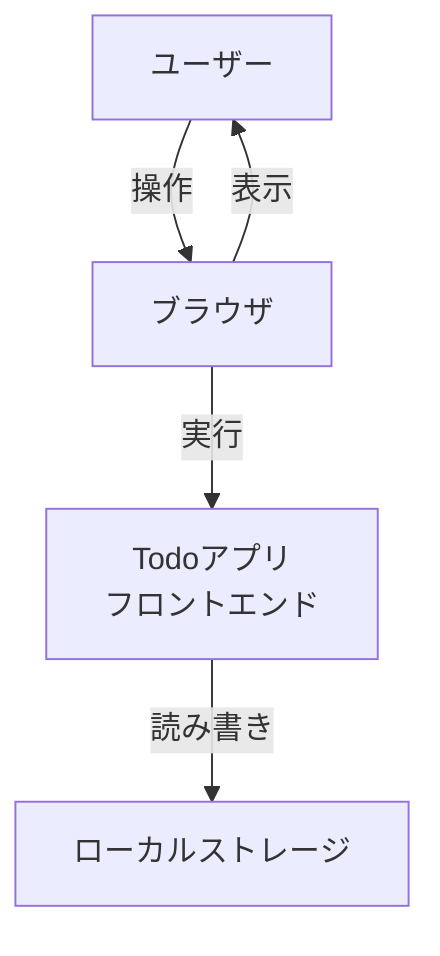
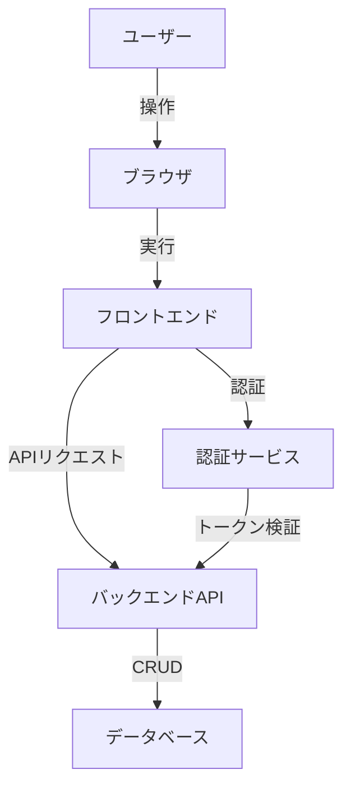
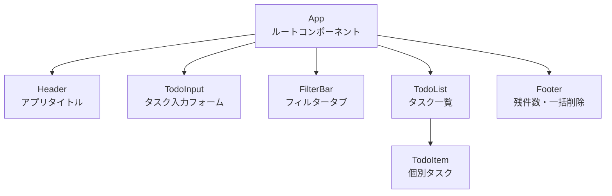
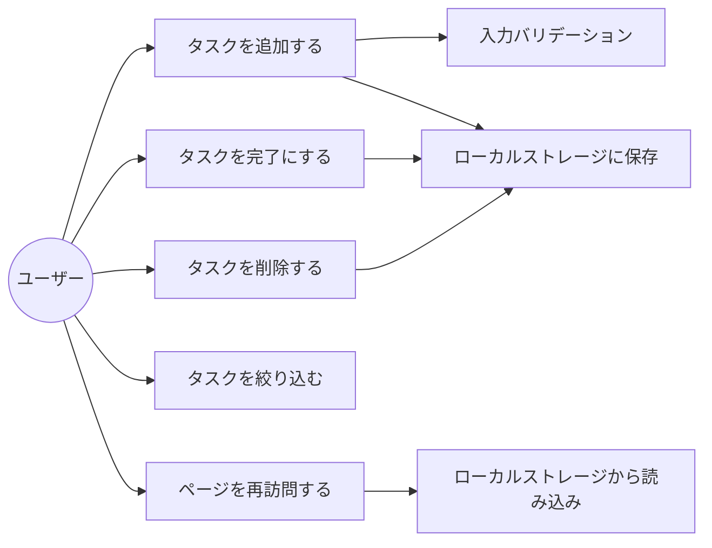
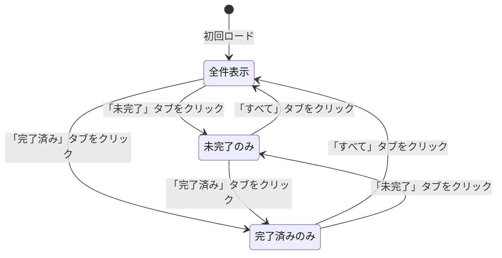

# 機能設計書

**バージョン:** 1.0
**作成日:** 2026-03-22
**ステータス:** ドラフト

---

## 1. システム構成図

### v1.0（フロントエンドのみ）



### 将来構成（認証・DB追加時）



---

## 2. データモデル定義

### Todo（タスク）

| フィールド | 型 | 必須 | 説明 |
|-----------|-----|------|------|
| id | string (UUID) | ✓ | 一意識別子 |
| text | string | ✓ | タスクの内容（1〜200文字） |
| completed | boolean | ✓ | 完了状態（デフォルト: false） |
| createdAt | string (ISO 8601) | ✓ | 作成日時 |

```json
{
  "id": "550e8400-e29b-41d4-a716-446655440000",
  "text": "買い物に行く",
  "completed": false,
  "createdAt": "2026-03-22T09:00:00.000Z"
}
```

### ローカルストレージ構造

| キー | 値 | 説明 |
|------|----|------|
| `todos` | `Todo[]` (JSON) | タスク一覧の配列 |

---

## 3. コンポーネント設計

### コンポーネント構成図



### 各コンポーネントの責務

| コンポーネント | 責務 |
|--------------|------|
| `App` | 状態管理（todos, filter）、ローカルストレージ連携 |
| `Header` | アプリタイトルの表示 |
| `TodoInput` | テキスト入力、バリデーション、追加イベント発火 |
| `FilterBar` | フィルター状態の切り替え（all / active / completed） |
| `TodoList` | フィルター済みタスクのリスト表示 |
| `TodoItem` | 個別タスクの表示、完了トグル、削除イベント発火 |
| `Footer` | 未完了タスク件数の表示、完了済み一括削除 |

---

## 4. ユースケース図



---

## 5. 画面遷移図

v1.0はシングルページアプリケーション（SPA）のため、画面遷移はなく、フィルター切り替えのみ。



---

## 6. ワイヤーフレーム

### デスクトップ（PC）

```
┌──────────────────────────────────────────┐
│              Todo アプリ                  │
├──────────────────────────────────────────┤
│  ┌────────────────────────┐  ┌────────┐  │
│  │ タスクを入力...         │  │  追加  │  │
│  └────────────────────────┘  └────────┘  │
├──────────────────────────────────────────┤
│   [すべて]  [未完了]  [完了済み]          │
├──────────────────────────────────────────┤
│  □  タスク1                        [削除] │
│  ☑  ~~タスク2~~                    [削除] │
│  □  タスク3                        [削除] │
├──────────────────────────────────────────┤
│  2件残っています        [完了済みを削除]  │
└──────────────────────────────────────────┘
```

### モバイル（スマートフォン）

```
┌─────────────────────┐
│     Todo アプリ      │
├─────────────────────┤
│ ┌─────────────────┐ │
│ │ タスクを入力... │ │
│ └─────────────────┘ │
│ ┌─────────────────┐ │
│ │      追加       │ │
│ └─────────────────┘ │
├─────────────────────┤
│ [すべて][未完了]    │
│ [完了済み]          │
├─────────────────────┤
│ □ タスク1    [削除] │
│ ☑ ~~タスク2~~ [削除]│
│ □ タスク3    [削除] │
├─────────────────────┤
│ 2件残っています     │
│ [完了済みを削除]    │
└─────────────────────┘
```

---

## 7. 状態管理設計

### アプリケーション状態

| 状態 | 型 | 初期値 | 説明 |
|------|----|--------|------|
| `todos` | `Todo[]` | `[]` | タスク一覧（ローカルストレージから復元） |
| `filter` | `'all' \| 'active' \| 'completed'` | `'all'` | 現在のフィルター |

### 操作と状態変化

| 操作 | 状態変化 |
|------|---------|
| タスク追加 | `todos` に新規 Todo を追加 → ローカルストレージに保存 |
| タスク完了トグル | 対象 Todo の `completed` を反転 → ローカルストレージに保存 |
| タスク削除 | `todos` から対象 Todo を除去 → ローカルストレージに保存 |
| フィルター変更 | `filter` を更新（ローカルストレージへの保存は不要） |
| 完了済み一括削除 | `completed === true` の Todo をすべて除去 → ローカルストレージに保存 |

---

## 8. 将来拡張への考慮

v1.0は将来のバックエンド追加を見越して以下を意識して設計する：

- タスクのデータ構造はREST APIレスポンスを想定したJSONフォーマットにする
- データアクセスロジックをUIコンポーネントから分離する（ローカルストレージ操作を専用モジュールに集約）
- 認証・DB追加時にフロントエンドの変更を最小限にできるよう、APIレイヤーを抽象化する
