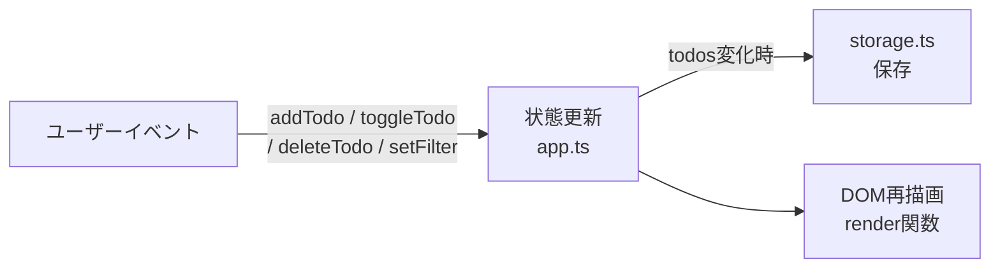

# 初回実装 設計

**作業ディレクトリ:** `.steering/20260322-initial-implementation/`
**作成日:** 2026-03-22
**ステータス:** ドラフト

---

## 1. 実装アプローチ

### 基本方針
- TypeScript（バニラ）+ Vite + Tailwind CSS で実装
- フレームワークなしのため、DOM操作とイベント駆動で実装する
- `app.ts` が状態を一元管理し、状態変化のたびにDOMを再描画する

### 状態管理フロー



---

## 2. ファイル構成

```
frontend/
├── index.html
├── vite.config.ts
├── tailwind.config.ts
├── tsconfig.json
├── package.json
├── Dockerfile
├── nginx.conf
└── src/
    ├── main.ts                 # エントリーポイント（DOMContentLoaded）
    ├── app.ts                  # 状態管理・イベント登録・レンダリング
    ├── types/
    │   └── todo.ts             # Todo型・FilterType型
    ├── components/
    │   ├── TodoInput.ts        # 入力フォームのHTML生成
    │   ├── FilterBar.ts        # フィルタータブのHTML生成
    │   ├── TodoList.ts         # タスク一覧のHTML生成
    │   ├── TodoItem.ts         # 個別タスクのHTML生成
    │   └── Footer.ts           # フッターのHTML生成
    ├── services/
    │   └── storage.ts          # ローカルストレージ操作
    └── styles/
        └── main.css            # Tailwind CSS ディレクティブ
```

---

## 3. 型定義

### `src/types/todo.ts`

```typescript
export interface Todo {
  id: string
  text: string
  completed: boolean
  createdAt: string  // ISO 8601形式
}

export type FilterType = 'all' | 'active' | 'completed'
```

---

## 4. 各モジュールの設計

### `src/services/storage.ts`

ローカルストレージへのアクセスを集約する。将来のAPI移行時はこのファイルのみ変更する。

```typescript
const STORAGE_KEY = 'todos'

export const loadTodos = (): Todo[] => { ... }   // JSONパース・エラー時は[]を返す
export const saveTodos = (todos: Todo[]): void => { ... }  // JSON.stringify して保存
```

### `src/app.ts`

アプリケーションの状態とロジックを一元管理する。

```typescript
// 状態
let todos: Todo[] = loadTodos()
let filter: FilterType = 'all'

// 操作
export const addTodo = (text: string): void => { ... }
export const toggleTodo = (id: string): void => { ... }
export const deleteTodo = (id: string): void => { ... }
export const clearCompleted = (): void => { ... }
export const setFilter = (f: FilterType): void => { ... }

// 描画
export const render = (): void => { ... }  // 全コンポーネントを再描画
```

### `src/components/*.ts`

各コンポーネントはHTML文字列またはDOM要素を返す純粋関数として実装する。

```typescript
// 例: TodoItem.ts
export const createTodoItem = (todo: Todo): HTMLElement => { ... }

// 例: FilterBar.ts
export const createFilterBar = (current: FilterType): HTMLElement => { ... }
```

### `src/main.ts`

DOMContentLoaded 後に `render()` を呼び出し、イベント委譲を設定する。

```typescript
document.addEventListener('DOMContentLoaded', () => {
  render()
  setupEventListeners()
})
```

---

## 5. イベント設計

イベントは `app.ts` でイベント委譲（Event Delegation）を使って一元管理する。

| イベント | トリガー | 処理 |
|---------|---------|------|
| `keydown` (Enter) | 入力フォーム | `addTodo()` → `render()` |
| `click` 追加ボタン | 追加ボタン | `addTodo()` → `render()` |
| `change` | チェックボックス | `toggleTodo(id)` → `render()` |
| `click` 削除ボタン | 削除ボタン | `deleteTodo(id)` → `render()` |
| `click` フィルタータブ | フィルタータブ | `setFilter(type)` → `render()` |
| `click` 一括削除ボタン | 一括削除ボタン | `clearCompleted()` → `render()` |

---

## 6. DOM構造

```html
<div id="app">
  <header>         <!-- Header: アプリタイトル -->
  <section>
    <div id="todo-input">    <!-- TodoInput: 入力フォーム -->
    <div id="filter-bar">    <!-- FilterBar: フィルタータブ -->
    <ul id="todo-list">      <!-- TodoList: タスク一覧 -->
      <li>...</li>           <!-- TodoItem: 個別タスク -->
    </ul>
    <footer id="footer">     <!-- Footer: 残件数・一括削除 -->
  </section>
</div>
```

---

## 7. Docker構成

### `frontend/Dockerfile`

```dockerfile
# Stage 1: ビルド
FROM node:20-alpine AS builder
WORKDIR /app
COPY package*.json ./
RUN npm ci
COPY . .
RUN npm run build

# Stage 2: 本番配信
FROM nginx:alpine
COPY --from=builder /app/dist /usr/share/nginx/html
COPY nginx.conf /etc/nginx/conf.d/default.conf
EXPOSE 80
```

### `frontend/nginx.conf`

```nginx
server {
    listen 80;
    root /usr/share/nginx/html;
    index index.html;

    # SPAのルーティング対応
    location / {
        try_files $uri $uri/ /index.html;
    }
}
```

### `docker-compose.yml`（開発用）

```yaml
services:
  frontend:
    build:
      context: ./frontend
      target: builder       # 開発時はbuilderステージを使用
    ports:
      - "5173:5173"
    volumes:
      - ./frontend:/app
      - /app/node_modules   # node_modulesはコンテナ内を使用
    command: npm run dev -- --host
```

---

## 8. セキュリティ考慮

- ユーザー入力のテキストは `textContent` で設定し、`innerHTML` は使用しない（XSS対策）
- タスクのテキストは200文字以内でバリデーションする
- 空白のみの入力（`text.trim() === ''`）はタスク追加を拒否する

---

## 9. 影響範囲

- 新規プロジェクトのため既存コードへの影響なし
- `docs/` 配下のドキュメントへの変更なし
