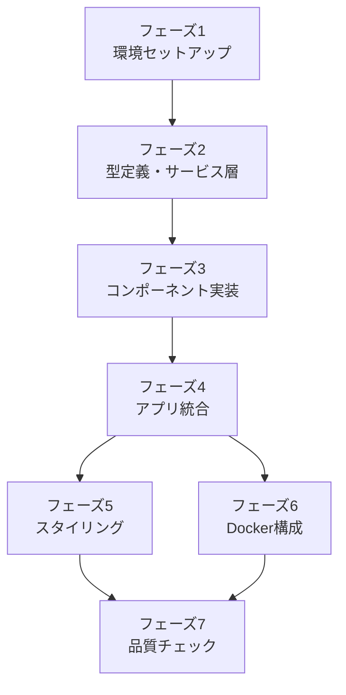

# 初回実装 タスクリスト

**作業ディレクトリ:** `.steering/20260322-initial-implementation/`
**作成日:** 2026-03-22
**ステータス:** 完了

---

## 進捗サマリー

| フェーズ | タスク数 | 完了 |
|---------|---------|------|
| 1. 環境セットアップ | 6 | 6 |
| 2. 型定義・サービス層 | 2 | 2 |
| 3. コンポーネント実装 | 5 | 5 |
| 4. アプリ統合 | 3 | 3 |
| 5. スタイリング | 2 | 2 |
| 6. Docker構成 | 3 | 3 |
| 7. 品質チェック | 4 | 4 |
| **合計** | **25** | **25** |

---

## フェーズ1: 環境セットアップ

- [x] **1-1** `frontend/` ディレクトリを作成し、`npm create vite@latest` で TypeScript プロジェクトを初期化する
- [x] **1-2** Tailwind CSS をインストール・設定する（`tailwind.config.ts`、`src/styles/main.css`）
- [x] **1-3** `tsconfig.json` に `strict: true` を設定する
- [x] **1-4** ESLint・Prettier をインストール・設定する
- [x] **1-5** Vitest をインストール・設定する
- [x] **1-6** `npm run dev` で開発サーバーが起動することを確認する

完了条件: `http://localhost:5173` でViteのデフォルト画面が表示される

---

## フェーズ2: 型定義・サービス層

- [x] **2-1** `src/types/todo.ts` を作成する（`Todo` インターフェース、`FilterType` 型）
- [x] **2-2** `src/services/storage.ts` を作成する（`loadTodos`・`saveTodos` 関数）
  - `loadTodos`: ローカルストレージから読み込み、パース失敗時は `[]` を返す
  - `saveTodos`: `Todo[]` をJSON文字列に変換して保存する
  - テスト: `storage.test.ts` を作成し、保存と読み込みが正しく動作することを確認する

完了条件: `npm test` でテストがすべて通る

---

## フェーズ3: コンポーネント実装

- [x] **3-1** `src/components/TodoInput.ts` を作成する
  - テキスト入力フィールドと追加ボタンを含むDOM要素を返す
  - 空白のみの入力ではタスクを追加できない

- [x] **3-2** `src/components/FilterBar.ts` を作成する
  - `all` / `active` / `completed` の3タブを生成する
  - 現在のフィルターをハイライト表示する

- [x] **3-3** `src/components/TodoItem.ts` を作成する
  - チェックボックス・テキスト・削除ボタンを含むDOM要素を返す
  - 完了タスクは取り消し線・グレーアウトで表示する
  - `textContent` を使用し `innerHTML` は使用しない（XSS対策）

- [x] **3-4** `src/components/TodoList.ts` を作成する
  - `TodoItem` の一覧を `<ul>` 要素で返す
  - タスクが0件の場合は「タスクがありません」を表示する

- [x] **3-5** `src/components/Footer.ts` を作成する
  - 未完了タスクの件数を表示する
  - 完了済みタスクが1件以上ある場合のみ「完了済みを削除」ボタンを表示する

完了条件: 各コンポーネントが正しいDOM要素を返す

---

## フェーズ4: アプリ統合

- [x] **4-1** `src/app.ts` を作成する
  - 状態（`todos`・`filter`）の管理
  - `addTodo` / `toggleTodo` / `deleteTodo` / `clearCompleted` / `setFilter` の実装
  - `render` 関数でコンポーネントをDOMに反映する

- [x] **4-2** `src/main.ts` を作成する
  - `DOMContentLoaded` 後に `render()` を呼び出す
  - イベント委譲でユーザー操作を `app.ts` の各関数に接続する

- [x] **4-3** `index.html` を更新する
  - アプリのHTML骨格（`
` 等）を記述する
  - Tailwind CSS のベーススタイルを適用する

完了条件: すべてのコア機能（F-01〜F-06）とフッター機能（F-07・F-08）が動作する

---

## フェーズ5: スタイリング

- [x] **5-1** Tailwind CSS でレスポンシブレイアウトを実装する
  - モバイル（320px〜）・デスクトップ（768px〜）の両方に対応する
  - ワイヤーフレーム（`docs/functional-design.md`）を参考にレイアウトを組む

- [x] **5-2** インタラクションのスタイルを実装する
  - ボタンのホバー・フォーカス状態
  - チェックボックスの完了状態（取り消し線・グレーアウト）
  - フィルタータブのアクティブ状態ハイライト

完了条件: PC・スマートフォンで見た目が崩れない

---

## フェーズ6: Docker構成

- [x] **6-1** `frontend/Dockerfile` を作成する（マルチステージビルド）
- [x] **6-2** `frontend/nginx.conf` を作成する
- [x] **6-3** `docker-compose.yml` を作成する（開発用）
  - `docker compose up` で開発サーバーが起動することを確認する

完了条件: `docker compose up` で `http://localhost:5173` にアクセスできる

---

## フェーズ7: 品質チェック

- [x] **7-1** `npm run lint` でESLintエラーがないことを確認する
- [x] **7-2** `npm run type-check` でTypeScriptの型エラーがないことを確認する
- [x] **7-3** `npm test` でテストがすべて通ることを確認する
- [x] **7-4** 受け入れ条件（`requirements.md`）のチェックリストをすべて確認する

完了条件: すべてのチェックがパスする

---

## 実装順序の依存関係

