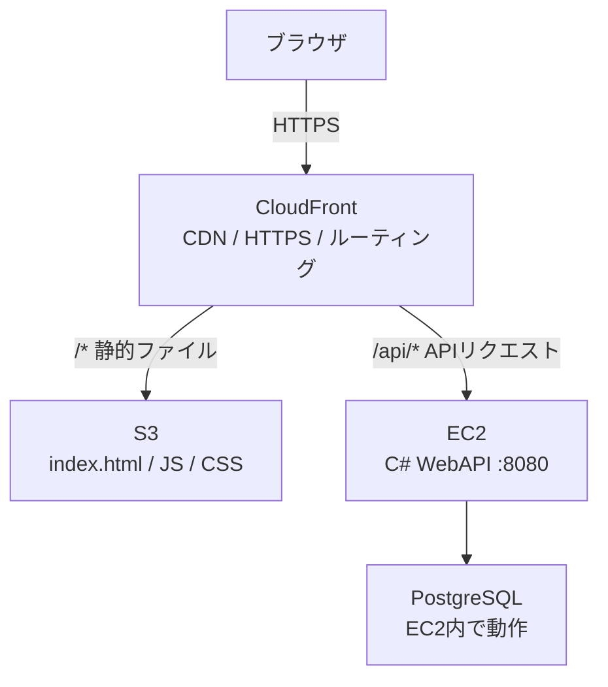

# AWSデプロイ手順書（パターンA）

**作成日:** 2026-04-07

---

## 1. 概要

このプロジェクトは TypeScript フロントエンド + C# WebAPI バックエンド + PostgreSQL という構成です。
AWS にデプロイする際は **パターンA（シンプル構成）** を採用します。

| レイヤー | AWSサービス | 内容 |
|---------|-----------|------|
| フロントエンド | S3 + CloudFront | 静的ファイルをS3に置き、CloudFrontで配信 |
| バックエンド | EC2 | C# WebAPI + PostgreSQL を1台のVMで動かす |

---

## 2. AWSサービスの役割

### S3（Simple Storage Service）

`npm run build` で生成される `dist/` フォルダの中身（HTML・JS・CSS）を保存するストレージです。
サーバーサイドの処理は不要で、ファイルを置くだけでWebホスティングができます。

```
dist/
├── index.html
├── assets/
│   ├── index-abc123.js   ← TypeScript → JS に変換済み
│   └── index-def456.css
└── favicon.ico
```

### CloudFront

S3の前段に置くCDN（コンテンツ配信ネットワーク）です。3つの役割を担います。

1. **HTTPS化** — ブラウザとの通信を暗号化する
2. **高速化** — 世界中のエッジサーバーにファイルをキャッシュして配信する
3. **ルーティング** — `/api/*` へのリクエストをEC2（バックエンド）に転送する

### EC2

C# WebAPI を常時起動し続けるための仮想マシン（VM）です。
PostgreSQL も同じEC2インスタンス内で動かします（パターンAの特徴）。

---

## 3. 通信フロー



**リクエストの流れ:**

1. ブラウザが `https://example.com` にアクセス
2. CloudFront が `index.html` を S3 から取得して返す
3. ブラウザ上でJSが動き、`/api/todos` などAPIを呼び出す
4. CloudFront が `/api/*` のリクエストをEC2に転送する
5. EC2上のC# WebAPIが処理してPostgreSQLからデータを取得し返す

---

## 4. フロントエンドのデプロイ

### ビルド

```bash
cd src/frontend
npm run build
# → dist/ フォルダが生成される
```

### S3へアップロード

```bash
aws s3 sync dist/ s3://<バケット名> --delete
```

- `--delete` オプションで、S3側にある古いファイルを削除する

### CloudFrontキャッシュ無効化

```bash
aws cloudfront create-invalidation \
  --distribution-id <ディストリビューションID> \
  --paths "/*"
```

ファイルを更新した後は必ずキャッシュを無効化すること。無効化しないとブラウザが古いファイルを受け取る。

---

## 5. バックエンドのデプロイ

### Dockerを使う場合（推奨）

EC2上でDockerを動かし、`docker-compose.prod.yml` を使ってコンテナを起動します。

```bash
# EC2にSSH接続
ssh -i <キーペア.pem> ec2-user@<EC2のIPアドレス>

# リポジトリを更新
git pull origin main

# 本番環境を起動
cd src
docker compose -f docker-compose.yml -f docker-compose.prod.yml up -d --build
```

### サービスの確認

```bash
# コンテナの起動状態を確認
docker compose -f docker-compose.yml -f docker-compose.prod.yml ps

# ログを確認
docker compose -f docker-compose.yml -f docker-compose.prod.yml logs backend
```

---

## 6. 環境変数・設定

### フロントエンド（ビルド時に設定）

| 変数名 | 内容 | 例 |
|--------|------|-----|
| `VITE_API_URL` | バックエンドAPIのベースURL | `https://api.example.com` |

```bash
# ビルド時に環境変数を指定する場合
VITE_API_URL=https://api.example.com npm run build
```

または `src/frontend/.env.production` に記述する。

### バックエンド（EC2上の設定）

| 変数名 | 内容 |
|--------|------|
| `ConnectionStrings__DefaultConnection` | PostgreSQL接続文字列 |
| `ASPNETCORE_ENVIRONMENT` | `Production` に設定 |

`src/.env` ファイルで管理し、EC2にコピーして使用する（Gitにはコミットしない）。

---

## 7. パターンAの注意点

| 注意点 | 内容 |
|--------|------|
| 単一障害点 | EC2が停止するとバックエンド全体が止まる |
| スケール | EC2のスペックアップ（垂直スケール）のみ対応可能 |
| DBバックアップ | 自前でPostgreSQLのバックアップ運用が必要 |
| コスト | EC2の月額料金が主なコスト（$10〜30程度） |

スケールや可用性が必要になった場合は、ECS Fargate + RDS のパターンBへ移行を検討する。
